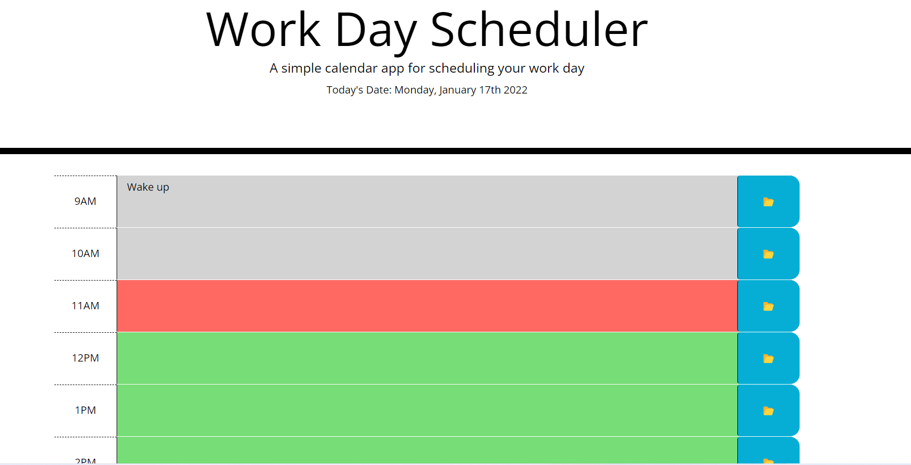
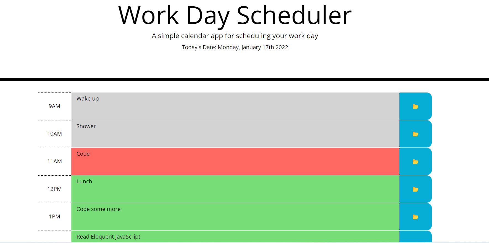
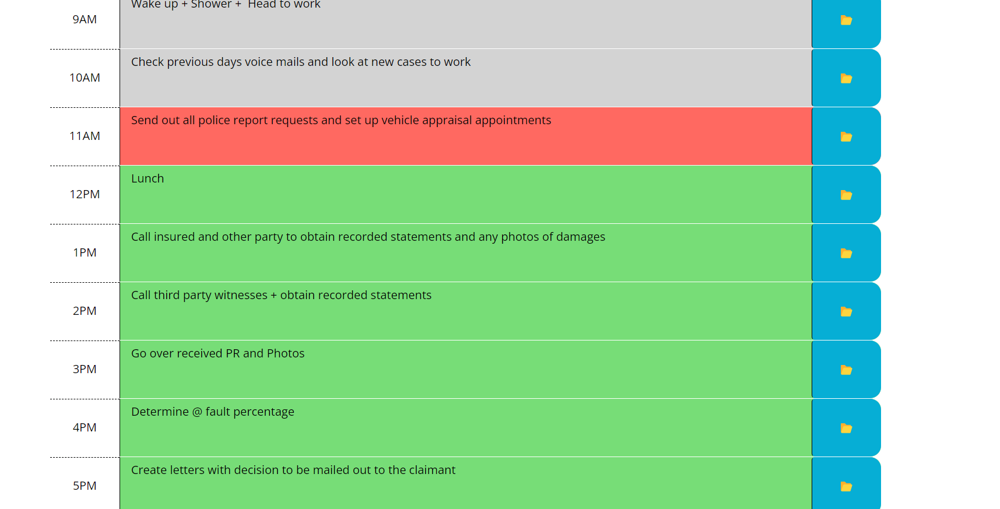

# The-Work-Day-Planner

(Homework-5: Third Party API's: Work Day Scheduler)

 

## Project Description: 

Odd numbered week homework assignment. This weeks homework assignment required us to develop a work day planner from a base template given to us. In my original day planner I created my own divs using labels, inputs, and buttons. However, my tutor indicated that using the premade template will make the stylization segment of the homework more streamlined. Therefore, I refactored my approach.

  

## Table of Contents:

 

- [Installation] (#installation)
- [Usage] (#usage)
- [Credits] (#credits)
- [License] (#license)
- [Badges] (#badges)
- [Features] (#features)
- [How] (#how to contribute)
- [Criteria] (#criteria's met)
- [HTML] (#html - details)
- [CSS] (#css - details)
- [URL] (#url (github repository))
- [URL] (#url (published webpage))

 

## Installation
 
** Go to <a href="https://jasonjayoo.github.io/The-Work-Day-Planner/" target="_blank">The-Work-Day-Planner</a> In order to view The-Work-Day-Planner Webpage.

 
 

## Usage: screenshots - (Highlighted Title(s) = a hyperlink to the direct image)

 
 

[Screenshot1](images/Screenshot1.png)  "Day Planner with only 9am event filled in"

 

[Screenshot2](images/Screenshot2.png)  "Day Planner with all events filled in"

 

[Screenshot3](images/Screenshot3.png)  "Day Planner showing 9am-5pm (image taken at 11am - hence 11am is red for the present)"

 
 

## Credits:

 

- My classmates: Tyler Welker, Jeoffrey Batangan, and Marcus Lewis were indespensible collaborators during the development of this day planner. They showed me several varied ways in which we could approach this assignment. I thank them all for their contribution to my web development growth.  

 

- I would also like to thank my tutor Mr. Faran Navazi for always guiding me toward a better method of developing my coding. He took me from 189 lines of JS to 44. Simply awesome.  

 
 

## License:
 
    -  MIT License - Copyright (c) 2022 Jason Yoo
 
 

## Badges:
 
    - UCI Full Stack Bootcamp
 
 

## Features:
 
    - Looking at the assignment from the top down
     
     
    - The first hurdle was to create a variable that rendered the current day and date using the local clientside data.
     
     
    - Then the buttons were tackled next. Console logged the button functions to make sure they were registering the click events.
     
     
    - After the buttons were made functional/interactive, the next hurdle was to link the text area (originally the input) to the button being clicked. My original approach was to link a specific button to a specific input. However, during the refactoring process my tutor showed me a better and more concise way to approach the buttons and link then to the textarea.
     
     
    - Then in terms of my original and refactored approach, setting the text data to the local storage and retrieving it from there remained basically the same except for the difference in the name of the key(s) and value(s).
     
     
    -Lastly the textarea (formerly the input) needed to be color coded so that if the designated time-block was in the past it will render gray, if in the present then red and in the future green. 
     
     
    - Making the colors change in reference to the time of day required the add and remove class attributes (interlacing it with the css) in both the original and refactored codes. However the two approaches were different from each other in how they removed and added the classes/attributes. Both approaches worked, which to me was very intriguing and eye opening. 

 
 

## How to Contribute:
 
    - My github repository is publically viewable. If you would like to contribute to the webpage please email me at jasonjayoo@outlook.com with the request and I will add you as a contributor on the repo. 
 
 

## Tests:
 
    - Try the work day planner yourself and plan out your day!. 
     
     
    - You can test out the webpage on vsc or directly in the inspect window of your browser (f12). 

 
 

## Criteria's met: 

 

1. The Work Day Planner meets the criteria's listed in the assignment.
 
 
    - The current day is displayed at the top of the calendar (I also added the year - YYYY).
     
     
    - When the user scrolls down they are presented with timeblocks for standard business hours.
     
     
    - Each timeblock is color coded to indicate whether it is in the past, present or future.
     
     
    - When the user clicks on a timeblock they can enter an event.
     
     
    - Once the user types in an event and clicks the save button it will save the event information in the local storage.
     
     
    - The saved event will continue to persist unless the user changes the event information, in which case the new info will persist.

 
 

## HTML - Details:

 

1. The HTMl includes bootstrap, fontawesome and googleapi links in the head.
 
 
2. The base template for the html was used in conjunction with the css base template.
 
 
3. Divs using the predesignated class names were added upon with my own unique id and class names.
 
 
4. In my original version I created nine divs with labels, inputs and buttons. However, with my tutors advice I followed the premade template of a div indicating the time of day instead of a label, and a text area instead of an input.
 
 
5. Nonetheless, nine separate divs were created for each individual time block. 
 
 

## CSS - Details:

 

1. In my original approach I created my own stylizations for the labels(s), input(s), and button(s). However, in lue of the refactoring where the premade template was utilized, the css in essence remained unchanged from what was given to us originally. Understandably, the assignment's purpose is to hone our programming abilities and not styling. Therefore, I had no qualms with returning to the premade template. 
 
 
2. Media Queries were added to the original work but was not necessary when using the bootstrap premades. Which made any adjustments to smaller screens unnecessary. 

 
 

## JS - Details:

 

1. I will skip the boring details of my original JS approach which resulted in 189 lines of code. To put it simply: I created individual button click events and input data that was then stored and retrieved via the localStorage setItems and getItems for each timeblock. 
 
 
2. I placed the date element setting at the top for my own mental organization. However, it is a stand alone variable and can be placed pretty much anywhere in the code for it to work.
 
 
3. The ready function that encompasses the entirety of the inactive aspect of the assignment comes next. My original approach was more analog and tackled one timeblock piecemeal. The refactored method was far more efficient.
 
 
4. The saveBtn class was set to react to the action of the button being clicked by the user. (this) was utilized to grab the nearest sibling of the saveBtn titled as description to get the value of the text area (aka the users typed event information).
 
 
5. The variable titled 'time' was then affixed to the saveBtn's parent the div id with the different military times as the attributes id.
 
 
6. The date was then set to be save to the localStorage with the time variable as the key and the text area as the value. 
 
 
7. The next hurdle was to set the clientside time and connect it was the text area so that, depending on the time of day, the text area's background will change from gray (past), red(present), and green(future). 
 
 
8. A variable titled 'blockHour' was created in order to take the time-block class that held military time as a string and with parseInt render it as a integer/number. Which was then compared to the variable 'currentHour' that used the Jquery predesignated operators of moment and hour from the clientside cpu's current time to calculate the present time. 
 
 
9. 'if else' conditions were then utilized in order to add or remove css stylization classes. These conditions would either add or remove the class stylizations depending on the time of day for each time block. The function for the color change, depending on the time of day, was titled 'timeColor' which was called once the actual variables and conditions were created, in order to call the created function.
 
 
10. Finally, the specific div id names/numbers and text area class named 'description' data (aka values) were set to be retrieved from the localStorage to continued to render even when the webpage was refreshed. 

 
 

## URL (Github Repository):

Click [here](https://github.com/jasonjayoo/The-Work-Day-Planner) to go to the The-Work-Day-Planner Github Repository

 

## URL (Published Webpage):

<a href="https://jasonjayoo.github.io/The-Work-Day-Planner/" target="_blank">The-Work-Day-Planner</a>
